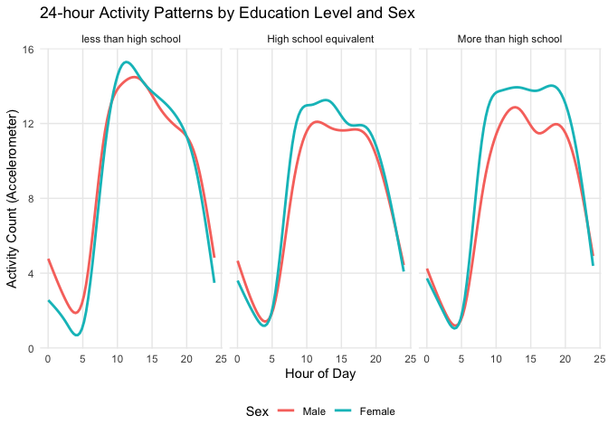

p8105_hw3_yz5248
================
yz5248
2025-10-05

``` r
library(p8105.datasets)
library(readr)
library(tidyverse)  
```

    ## ── Attaching core tidyverse packages ──────────────────────── tidyverse 2.0.0 ──
    ## ✔ dplyr     1.1.4     ✔ purrr     1.0.2
    ## ✔ forcats   1.0.0     ✔ stringr   1.5.1
    ## ✔ ggplot2   4.0.0     ✔ tibble    3.2.1
    ## ✔ lubridate 1.9.4     ✔ tidyr     1.3.1
    ## ── Conflicts ────────────────────────────────────────── tidyverse_conflicts() ──
    ## ✖ dplyr::filter() masks stats::filter()
    ## ✖ dplyr::lag()    masks stats::lag()
    ## ℹ Use the conflicted package (<http://conflicted.r-lib.org/>) to force all conflicts to become errors

``` r
library(scales)      
```

    ## 
    ## Attaching package: 'scales'
    ## 
    ## The following object is masked from 'package:purrr':
    ## 
    ##     discard
    ## 
    ## The following object is masked from 'package:readr':
    ## 
    ##     col_factor

``` r
library(knitr)
library(lubridate)
library(janitor)
```

    ## 
    ## Attaching package: 'janitor'
    ## 
    ## The following objects are masked from 'package:stats':
    ## 
    ##     chisq.test, fisher.test

``` r
library(patchwork)
library(ggplot2)
library(gt)
theme_set(theme_minimal(base_size = 14))
data("instacart")
```

# Problem 1

## number of aisles and the max term

``` r
n_aisles = 
  instacart |>
  distinct(aisle_id, aisle) |>
  nrow()
n_aisles   
```

    ## [1] 134

``` r
aisle_counts = 
  instacart |>
  count(aisle, sort = TRUE) |>
  rename(n_orders = n)

aisle_counts |>
  slice_head(n = 20) |> 
  knitr::kable()
```

| aisle                         | n_orders |
|:------------------------------|---------:|
| fresh vegetables              |   150609 |
| fresh fruits                  |   150473 |
| packaged vegetables fruits    |    78493 |
| yogurt                        |    55240 |
| packaged cheese               |    41699 |
| water seltzer sparkling water |    36617 |
| milk                          |    32644 |
| chips pretzels                |    31269 |
| soy lactosefree               |    26240 |
| bread                         |    23635 |
| refrigerated                  |    23228 |
| ice cream ice                 |    22676 |
| frozen produce                |    22453 |
| eggs                          |    19875 |
| crackers                      |    19592 |
| frozen meals                  |    18221 |
| energy granola bars           |    17449 |
| lunch meat                    |    16957 |
| soft drinks                   |    16279 |
| cereal                        |    16201 |

Here are totally 134 aisles.  
From the table we find that fresh vegetables is the most terms.

### the plot showing the number of items ordered in each aisle

``` r
aisle_counts |> 
  filter(n_orders > 10000) |> 
  mutate(aisle = fct_reorder(aisle, n_orders)) |> 
  ggplot(aes(x = aisle, y = n_orders)) +
  geom_col(fill = "blue") +
  coord_flip() +
  scale_y_continuous(labels = comma) +
  labs(
    title = "Aisles with more than 10,000 items ordered",
    x = "Aisle",
    y = "Number of items ordered"
  ) +
  theme_minimal(base_size = 13)
```

<!-- -->

## table showing the three most popular items

``` r
target_aisles = c("baking ingredients", "dog food care", "packaged vegetables fruits")

top3_items = 
  instacart |> 
  filter(aisle == target_aisles) |> 
  count(aisle, product_name, sort = TRUE) |> 
  group_by(aisle) |> 
  slice_head(n = 3) |> 
  ungroup()

top3_items |> 
  kable()
```

| aisle | product_name | n |
|:---|:---|---:|
| baking ingredients | Light Brown Sugar | 157 |
| baking ingredients | Pure Baking Soda | 140 |
| baking ingredients | Organic Vanilla Extract | 122 |
| dog food care | Organix Grain Free Chicken & Vegetable Dog Food | 14 |
| dog food care | Organix Chicken & Brown Rice Recipe | 13 |
| dog food care | Original Dry Dog | 9 |
| packaged vegetables fruits | Organic Baby Spinach | 3324 |
| packaged vegetables fruits | Organic Raspberries | 1920 |
| packaged vegetables fruits | Organic Blueberries | 1692 |

## table showing the mean hour of the day

``` r
weekday_labels = c("Sunday","Monday","Tuesday","Wednesday","Thursday","Friday","Saturday")

mean_hour = 
  instacart |>
  filter(product_name == c("Pink Lady Apples", "Coffee Ice Cream")) |>
  group_by(product_name, order_dow) |>
  summarise(mean_hour = mean(order_hour_of_day), .groups = "drop") |>
  mutate(weekday = factor(order_dow, levels = 0:6, labels = weekday_labels)) |>
  select(product_name, weekday, mean_hour) |>
  pivot_wider(names_from = weekday, values_from = mean_hour)
```

    ## Warning: There was 1 warning in `filter()`.
    ## ℹ In argument: `product_name == c("Pink Lady Apples", "Coffee Ice Cream")`.
    ## Caused by warning in `product_name == c("Pink Lady Apples", "Coffee Ice Cream")`:
    ## ! longer object length is not a multiple of shorter object length

``` r
mean_hour |>
  mutate(across(where(is.numeric), ~round(., 1))) |>
  kable()
```

| product_name     | Sunday | Monday | Tuesday | Wednesday | Thursday | Friday | Saturday |
|:-----------------|-------:|-------:|--------:|----------:|---------:|-------:|---------:|
| Coffee Ice Cream |   13.2 |   15.0 |    15.3 |      15.4 |     15.2 |   10.3 |     12.4 |
| Pink Lady Apples |   12.2 |   11.7 |    12.0 |      13.9 |     11.9 |   13.9 |     11.6 |

\#Problem 2

``` r
Zip_Codes = 
  read_csv("zillow_data/Zip Codes.csv") |>
  janitor::clean_names()|>
  view()
```

    ## Rows: 322 Columns: 7
    ## ── Column specification ────────────────────────────────────────────────────────
    ## Delimiter: ","
    ## chr (4): County, County Code, File Date, Neighborhood
    ## dbl (3): State FIPS, County FIPS, ZipCode
    ## 
    ## ℹ Use `spec()` to retrieve the full column specification for this data.
    ## ℹ Specify the column types or set `show_col_types = FALSE` to quiet this message.

``` r
Zip_zori = 
  read_csv("zillow_data/Zip_zori_uc_sfrcondomfr_sm_month_NYC.csv") |>
  janitor::clean_names()|>
  view()
```

    ## Rows: 149 Columns: 125
    ## ── Column specification ────────────────────────────────────────────────────────
    ## Delimiter: ","
    ## chr   (6): RegionType, StateName, State, City, Metro, CountyName
    ## dbl (119): RegionID, SizeRank, RegionName, 2015-01-31, 2015-02-28, 2015-03-3...
    ## 
    ## ℹ Use `spec()` to retrieve the full column specification for this data.
    ## ℹ Specify the column types or set `show_col_types = FALSE` to quiet this message.

``` r
zip_counts <- Zip_Codes |>
  group_by(zip_code) |>
  summarise(n_obs = n()) |>
  arrange(desc(n_obs)) |>
  summarise(
    full_coverage = sum(n_obs == 116),
    sparse_coverage = sum(n_obs < 10)
  )
zip_counts
```

    ## # A tibble: 1 × 2
    ##   full_coverage sparse_coverage
    ##           <int>           <int>
    ## 1             0             320

From the table, we can find that there are 0 ZIP codes are observed 116
times and 320 ZIP codes are observed fewer than 10 times.  
The reason why some ZIP codes are observed rarely and others observed in
each month may are:  
1. Different population density and housing activity among variable
locations; 2. Missing data, the information of some areas is hard to
collect.

## table showing the average rental price in each borough and year

``` r
zip_df = 
  Zip_Codes |> 
  transmute(                      
    zip = as.character(zip_code), 
    borough = case_when(          
      str_detect(county, "New York") ~ "Manhattan",
      str_detect(county, "Kings") ~ "Brooklyn",
      str_detect(county, "Queens") ~ "Queens",
      str_detect(county, "Bronx") ~ "Bronx",
      str_detect(county, "Richmond") ~ "Staten Island",
      TRUE ~ "Other"
    )
  )

rent_df =
  Zip_zori |>
  select(region_name, starts_with("x")) |>   
  rename(zip = region_name) |>
  pivot_longer(
    cols = starts_with("x"),
    names_to = "month_raw",
    values_to = "rent"
  ) |>
  mutate(
    month = str_remove(month_raw, "^x"),
    month = str_replace_all(month, "_", "-"),
    month = ymd(month),
    zip = as.character(zip),
    rent = as.numeric(rent)
  ) |>
  select(zip, month, rent) |>
  drop_na(rent)|>
  view()

rent_with_borough = rent_df |>
  left_join(zip_df, by = "zip")
```

    ## Warning in left_join(rent_df, zip_df, by = "zip"): Detected an unexpected many-to-many relationship between `x` and `y`.
    ## ℹ Row 2759 of `x` matches multiple rows in `y`.
    ## ℹ Row 256 of `y` matches multiple rows in `x`.
    ## ℹ If a many-to-many relationship is expected, set `relationship =
    ##   "many-to-many"` to silence this warning.

``` r
borough_year =
  rent_with_borough |>
  filter(!is.na(borough)) |>
  mutate(year = year(month)) |>
  group_by(borough, year) |>
  summarise(
    mean_rent = mean(rent, na.rm = TRUE),
    n = n(),
    .groups = "drop"
  ) |>
  arrange(borough, year)

borough_year |> 
  pivot_wider(names_from = year, values_from = mean_rent) |> 
  mutate(across(-borough, ~ round(.x, 0))) |> 
  kable(
    caption = "Average Rental Price by Borough and Year (2015–2024)",
    digits = 0
  )
```

| borough       |   n | 2015 | 2016 | 2017 | 2018 | 2019 | 2020 | 2021 | 2022 | 2023 | 2024 |
|:--------------|----:|-----:|-----:|-----:|-----:|-----:|-----:|-----:|-----:|-----:|-----:|
| Bronx         |   8 | 1760 |   NA |   NA |   NA |   NA |   NA |   NA |   NA |   NA |   NA |
| Bronx         |  30 |   NA | 1520 |   NA |   NA |   NA |   NA |   NA |   NA |   NA |   NA |
| Bronx         |  46 |   NA |   NA | 1544 |   NA |   NA |   NA |   NA |   NA |   NA |   NA |
| Bronx         |  59 |   NA |   NA |   NA | 1639 | 1706 |   NA |   NA |   NA |   NA |   NA |
| Bronx         |  71 |   NA |   NA |   NA |   NA |   NA | 1811 |   NA |   NA |   NA |   NA |
| Bronx         |  80 |   NA |   NA |   NA |   NA |   NA |   NA | 1858 |   NA |   NA |   NA |
| Bronx         | 110 |   NA |   NA |   NA |   NA |   NA |   NA |   NA | 2054 |   NA |   NA |
| Bronx         | 144 |   NA |   NA |   NA |   NA |   NA |   NA |   NA |   NA | 2285 |   NA |
| Bronx         | 126 |   NA |   NA |   NA |   NA |   NA |   NA |   NA |   NA |   NA | 2497 |
| Brooklyn      | 238 | 2493 |   NA |   NA |   NA |   NA |   NA |   NA |   NA |   NA |   NA |
| Brooklyn      | 256 |   NA | 2520 |   NA |   NA |   NA |   NA |   NA |   NA |   NA |   NA |
| Brooklyn      | 265 |   NA |   NA | 2546 |   NA |   NA |   NA |   NA |   NA |   NA |   NA |
| Brooklyn      | 288 |   NA |   NA |   NA | 2547 |   NA |   NA |   NA |   NA |   NA |   NA |
| Brooklyn      | 298 |   NA |   NA |   NA |   NA | 2631 |   NA |   NA |   NA |   NA |   NA |
| Brooklyn      | 327 |   NA |   NA |   NA |   NA |   NA | 2555 |   NA |   NA |   NA |   NA |
| Brooklyn      | 352 |   NA |   NA |   NA |   NA |   NA |   NA | 2550 |   NA |   NA |   NA |
| Brooklyn      | 400 |   NA |   NA |   NA |   NA |   NA |   NA |   NA | 2868 |   NA |   NA |
| Brooklyn      | 417 |   NA |   NA |   NA |   NA |   NA |   NA |   NA |   NA | 3015 |   NA |
| Brooklyn      | 285 |   NA |   NA |   NA |   NA |   NA |   NA |   NA |   NA |   NA | 3126 |
| Manhattan     | 420 | 3006 |   NA |   NA |   NA |   NA |   NA |   NA |   NA |   NA |   NA |
| Manhattan     | 452 |   NA | 3015 |   NA |   NA |   NA |   NA |   NA |   NA |   NA |   NA |
| Manhattan     | 480 |   NA |   NA | 3109 | 3160 |   NA |   NA |   NA |   NA |   NA |   NA |
| Manhattan     | 492 |   NA |   NA |   NA |   NA | 3285 |   NA |   NA |   NA |   NA |   NA |
| Manhattan     | 513 |   NA |   NA |   NA |   NA |   NA | 3091 |   NA |   NA |   NA |   NA |
| Manhattan     | 531 |   NA |   NA |   NA |   NA |   NA |   NA | 3124 |   NA |   NA |   NA |
| Manhattan     | 540 |   NA |   NA |   NA |   NA |   NA |   NA |   NA | 3753 |   NA |   NA |
| Manhattan     | 541 |   NA |   NA |   NA |   NA |   NA |   NA |   NA |   NA | 3908 |   NA |
| Manhattan     | 370 |   NA |   NA |   NA |   NA |   NA |   NA |   NA |   NA |   NA | 4053 |
| Queens        |  65 | 2215 |   NA |   NA |   NA |   NA |   NA |   NA |   NA |   NA |   NA |
| Queens        | 108 |   NA | 2272 |   NA |   NA |   NA |   NA |   NA |   NA |   NA |   NA |
| Queens        | 132 |   NA |   NA | 2263 | 2292 | 2388 |   NA |   NA |   NA |   NA |   NA |
| Queens        | 161 |   NA |   NA |   NA |   NA |   NA | 2316 |   NA |   NA |   NA |   NA |
| Queens        | 234 |   NA |   NA |   NA |   NA |   NA |   NA | 2211 |   NA |   NA |   NA |
| Queens        | 275 |   NA |   NA |   NA |   NA |   NA |   NA |   NA | 2406 |   NA |   NA |
| Queens        | 307 |   NA |   NA |   NA |   NA |   NA |   NA |   NA |   NA | 2562 |   NA |
| Queens        | 242 |   NA |   NA |   NA |   NA |   NA |   NA |   NA |   NA |   NA | 2694 |
| Staten Island |   5 |   NA |   NA |   NA |   NA |   NA | 1978 |   NA |   NA |   NA |   NA |
| Staten Island |  27 |   NA |   NA |   NA |   NA |   NA |   NA | 2045 |   NA |   NA |   NA |
| Staten Island |  57 |   NA |   NA |   NA |   NA |   NA |   NA |   NA | 2147 |   NA |   NA |
| Staten Island |  70 |   NA |   NA |   NA |   NA |   NA |   NA |   NA |   NA | 2333 |   NA |
| Staten Island |  52 |   NA |   NA |   NA |   NA |   NA |   NA |   NA |   NA |   NA | 2536 |

Average Rental Price by Borough and Year (2015–2024)

From the table, we can find that:  
From 2015 to 2024, average rental prices across New York City’s boroughs
showed a steady upward trend, with a slight decline around 2020–2021
likely due to the COVID-19 pandemic.  
Manhattan consistently had the highest rents, followed by Brooklyn and
Queens, while the Bronx and Staten Island remained more affordable but
still experienced notable increases. After 2021, rental prices rebounded
sharply—especially in Manhattan and Brooklyn—reflecting renewed housing
demand. Overall, rents have risen citywide, and the price gap between
Manhattan and the outer boroughs has continued to widen, highlighting
growing housing affordability challenges in New York City.

## plot showing NYC Rental Prices within ZIP codes

``` r
rent_tidy = 
  left_join(rent_df, zip_df, by = "zip") |>
  rename(Year = month) |>
  view()
```

    ## Warning in left_join(rent_df, zip_df, by = "zip"): Detected an unexpected many-to-many relationship between `x` and `y`.
    ## ℹ Row 2759 of `x` matches multiple rows in `y`.
    ## ℹ Row 256 of `y` matches multiple rows in `x`.
    ## ℹ If a many-to-many relationship is expected, set `relationship =
    ##   "many-to-many"` to silence this warning.

``` r
rent_summary =
  rent_tidy |>
  mutate(Year = year(Year)) |>    
  group_by(borough, Year) |>
  summarise(mean_rent = mean(rent, na.rm = TRUE)) |>
  arrange(borough, Year) 
```

    ## `summarise()` has grouped output by 'borough'. You can override using the
    ## `.groups` argument.

``` r
rent_summary |>
  knitr::kable(
    caption = "Average Rental Price by Borough and Year (Zillow ZORI Data)",
    digits = 0
  ) 
```

| borough       | Year | mean_rent |
|:--------------|-----:|----------:|
| Bronx         | 2015 |      1760 |
| Bronx         | 2016 |      1520 |
| Bronx         | 2017 |      1544 |
| Bronx         | 2018 |      1639 |
| Bronx         | 2019 |      1706 |
| Bronx         | 2020 |      1811 |
| Bronx         | 2021 |      1858 |
| Bronx         | 2022 |      2054 |
| Bronx         | 2023 |      2285 |
| Bronx         | 2024 |      2497 |
| Brooklyn      | 2015 |      2493 |
| Brooklyn      | 2016 |      2520 |
| Brooklyn      | 2017 |      2546 |
| Brooklyn      | 2018 |      2547 |
| Brooklyn      | 2019 |      2631 |
| Brooklyn      | 2020 |      2555 |
| Brooklyn      | 2021 |      2550 |
| Brooklyn      | 2022 |      2868 |
| Brooklyn      | 2023 |      3015 |
| Brooklyn      | 2024 |      3126 |
| Manhattan     | 2015 |      3006 |
| Manhattan     | 2016 |      3015 |
| Manhattan     | 2017 |      3109 |
| Manhattan     | 2018 |      3160 |
| Manhattan     | 2019 |      3285 |
| Manhattan     | 2020 |      3091 |
| Manhattan     | 2021 |      3124 |
| Manhattan     | 2022 |      3753 |
| Manhattan     | 2023 |      3908 |
| Manhattan     | 2024 |      4053 |
| Queens        | 2015 |      2215 |
| Queens        | 2016 |      2272 |
| Queens        | 2017 |      2263 |
| Queens        | 2018 |      2292 |
| Queens        | 2019 |      2388 |
| Queens        | 2020 |      2316 |
| Queens        | 2021 |      2211 |
| Queens        | 2022 |      2406 |
| Queens        | 2023 |      2562 |
| Queens        | 2024 |      2694 |
| Staten Island | 2020 |      1978 |
| Staten Island | 2021 |      2045 |
| Staten Island | 2022 |      2147 |
| Staten Island | 2023 |      2333 |
| Staten Island | 2024 |      2536 |

Average Rental Price by Borough and Year (Zillow ZORI Data)

``` r
plot_trend = ggplot(rent_tidy, aes(x = Year, y = rent, group = zip)) +
  geom_line(aes(color = borough), alpha = 0.3, size = 0.6) +
  facet_wrap(~ borough, scales = "free_y") +  
  labs(
    title = "NYC Rental Prices by ZIP Code and Borough (Zillow ZORI Data)",
    x = "Year",
    y = "Rental Price (USD)",
    color = "Borough"
  ) +
  theme_minimal(base_size = 14) +
  theme(
    legend.position = "none",
    strip.text = element_text(face = "bold", size = 13)
  )
```

    ## Warning: Using `size` aesthetic for lines was deprecated in ggplot2 3.4.0.
    ## ℹ Please use `linewidth` instead.
    ## This warning is displayed once every 8 hours.
    ## Call `lifecycle::last_lifecycle_warnings()` to see where this warning was
    ## generated.

``` r
plot_trend
```

<!-- -->
The plot illustrates the rental price trends in New York City’s five
boroughs—Bronx, Brooklyn, Manhattan, Queens, and Staten Island—from 2016
to 2024, based on Zillow ZORI data. Manhattan consistently has the
highest rental prices, peaking around \$7,000, and shows a general
upward trend with some fluctuations. The Bronx and Brooklyn also exhibit
steady increases, with Brooklyn displaying more variability. Queens has
a moderate increase, while Staten Island shows significant volatility
with a sharp rise, especially noticeable from 2022. Overall, all
boroughs demonstrate an upward trend in rental prices, reflecting the
growing demand and cost of living in NYC.

## About 2023

``` r
rent_2023 = rent_tidy |>
  filter(year(Year) == 2023)


zip_mean_2023 = rent_2023 |>
  group_by(borough, zip) |>
  summarise(mean_rent = mean(rent, na.rm = TRUE), .groups = "drop")|>
  ggplot(aes(x = borough, y = mean_rent, fill = borough)) +
  geom_boxplot(alpha = 0.8, outlier.color = "red", outlier.shape = 1) +
  geom_jitter(width = 0.2, alpha = 0.4, color = "black") + 
  labs(
    title = "Distribution of Average ZIP-Code-Level Rents in 2023",
    subtitle = "Comparison across NYC boroughs (Zillow ZORI Data)",
    x = "Borough",
    y = "Average Monthly Rent (USD)"
  ) +
  theme_minimal(base_size = 14) +
  theme(
    legend.position = "none",
    plot.title = element_text(face = "bold", size = 16),
    plot.subtitle = element_text(size = 13),
    axis.text.x = element_text(face = "bold")
  )
zip_mean_2023
```

<!-- -->
From the boxplot, we can find that analysis of average monthly rents
across New York City’s boroughs for 2023 reveals significant disparities
in rental prices. Manhattan leads with the highest median rent,
approximately \$4,000, and exhibits the greatest variability, with
prices ranging up to \$8,000. Brooklyn follows with a median around
\$3,000 and a broad spread, indicating diverse rental options. Queens
has a more moderate median rent of about \$2,500, while the Bronx and
Staten Island both show lower medians around \$2,000, with Staten Island
having the narrowest spread, suggesting more uniform rental prices. This
data underscores the stark differences in rental affordability and
variety across NYC’s boroughs, highlighting Manhattan’s premium status
and the more consistent, yet still diverse, rental markets in the outer
boroughs.

## Combination of the two plots

``` r
combined_plot = plot_trend / zip_mean_2023 +
  plot_annotation(
    title = "NYC Rental Prices: Trends and 2023 Distributions",
    theme = theme(plot.title = element_text(face = "bold", size = 18))
  )

combined_plot
```

<!-- -->

``` r
ggsave("results/nyc_rental_combined_plot.png",
       combined_plot,
       width = 12, height = 10, dpi = 300)
```

\#Problem 3

## importing of data

``` r
nhanes_covar = 
  read_csv("nhanes_covar.csv",skip = 4) |> 
  janitor::clean_names() |>
  view()
```

    ## Rows: 250 Columns: 5
    ## ── Column specification ────────────────────────────────────────────────────────
    ## Delimiter: ","
    ## dbl (5): SEQN, sex, age, BMI, education
    ## 
    ## ℹ Use `spec()` to retrieve the full column specification for this data.
    ## ℹ Specify the column types or set `show_col_types = FALSE` to quiet this message.

``` r
nhanes_accel = 
  read_csv("nhanes_accel.csv") |> 
  janitor::clean_names() |>
  view()
```

    ## Rows: 250 Columns: 1441
    ## ── Column specification ────────────────────────────────────────────────────────
    ## Delimiter: ","
    ## dbl (1441): SEQN, min1, min2, min3, min4, min5, min6, min7, min8, min9, min1...
    ## 
    ## ℹ Use `spec()` to retrieve the full column specification for this data.
    ## ℹ Specify the column types or set `show_col_types = FALSE` to quiet this message.

``` r
nhanes_full = 
  left_join(nhanes_covar, nhanes_accel, by = "seqn")|>
  view()
```

## filtering the data

``` r
nhanes_clean = nhanes_full |>
  filter(age >= 21) |>
  drop_na(sex, bmi, education) |> 
  mutate(
    sex = factor(sex, 
                 levels = c(1, 2),
                 labels = c("Male", "Female")),
    education = factor(education,
                       levels = c(1, 2, 3),
                       labels = c("less than high school",
                                  "High school equivalent",
                                  "More than high school")
                       ),
  )
```

## table for the number of men and women in each education category

``` r
edu_gender_table = nhanes_clean |>
  count(education, sex) |>
  pivot_wider(
    names_from = sex, 
    values_from = n, 
    values_fill = 0
  ) |>
  mutate(Total = Male + Female) |>
  kable(
    caption = "Number of Men and Women by Education Level (NHANES Sample)",
    align = "lccc"
  )
edu_gender_table
```

| education              | Male | Female | Total |
|:-----------------------|:----:|:------:|:-----:|
| less than high school  |  27  |   28   |  55   |
| High school equivalent |  35  |   23   |  58   |
| More than high school  |  56  |   59   |  115  |

Number of Men and Women by Education Level (NHANES Sample)

This table shows the distribution of education levels among men and
women in the NHANES sample. Overall, the largest group is participants
with more than a high school education (115 individuals), while the
smallest group is those with less than high school education (55
individuals). The numbers of men and women are fairly similar within
each category, though men slightly outnumber women among those with a
high school equivalent education (35 vs. 23), whereas women slightly
outnumber men among the highest education group (59 vs. 56). These
results suggest that, in this sample, both men and women are generally
well-educated, with a small gender difference across education levels.

## plot of the age distributions for men and women in each education category

``` r
sex_education = 
  ggplot(nhanes_clean, aes(x = education, y = age, fill = sex)) +
  geom_boxplot(width = 0.15, position = position_dodge(0.9), outlier.shape = NA, alpha = 0.5) +
  labs(
    title = "Age Distributions by Education Level and Sex",
    subtitle = "NHANES Accelerometer Sample (Age ≥ 21)",
    x = "Education Level",
    y = "Age (years)",
    fill = "Sex"
  ) +
  theme_minimal(base_size = 14) +
  theme(
    axis.text.x = element_text(angle = 20, hjust = 1, face = "bold"),
    plot.title = element_text(face = "bold", size = 16),
    legend.position = "top"
  )
sex_education
```

<!-- -->
The boxplot provides a clear visual representation of the age
distributions across different education levels and sexes within the
NHANES Accelerometer Sample for individuals aged 21 and above. It
reveals that the median age is approximately 50 years for all groups,
indicating a predominantly middle-aged sample. The age distributions are
similar for both males and females across all education levels, with no
significant outliers observed. The interquartile ranges (IQRs) are also
comparable, suggesting similar variability in age across different
groups. This consistency in age distribution is important for ensuring
the reliability and generalizability of health and lifestyle studies
conducted using this sample.

## plot of total activities (y-axis) against age (x-axis)

``` r
total_activity = nhanes_clean |>
  mutate(total_activity = rowSums(select(cur_data(), starts_with("min")), na.rm = TRUE)) |>
  select(seqn, sex, age, education, total_activity) |>
  view()
```

    ## Warning: There was 1 warning in `mutate()`.
    ## ℹ In argument: `total_activity = rowSums(select(cur_data(),
    ##   starts_with("min")), na.rm = TRUE)`.
    ## Caused by warning:
    ## ! `cur_data()` was deprecated in dplyr 1.1.0.
    ## ℹ Please use `pick()` instead.

``` r
activity_plot = 
  ggplot(total_activity, aes(x = age, y = total_activity, color = sex)) +
  geom_point(alpha = 0.4) +
  geom_smooth(method = "loess", se = FALSE) +
  facet_wrap(~education) +
  labs(
    x = "Age",
    y = "Total Activity (sum of minute-level counts)",
    title = "Total Daily Activity vs Age by Sex and Education Level"
  ) +
  theme_minimal()
activity_plot
```

    ## `geom_smooth()` using formula = 'y ~ x'

<!-- -->
The plot depicting total daily activity against age, segmented by sex
and education level, reveals several key insights. It shows a general
decline in activity levels with increasing age across all education
levels. Males tend to exhibit slightly higher activity levels than
females, particularly in the groups with less than high school and high
school equivalent education. Notably, individuals with more than a high
school education display higher activity levels across most age groups
compared to those with lower education levels. The high school
equivalent group shows a bimodal trend with two distinct peaks,
suggesting two periods of increased activity, likely around middle age.
There is also considerable variability in activity levels within each
age and education group, as indicated by the spread of data points
around the trend lines. The presence of outliers, especially in older
age groups, indicates that some individuals maintain high activity
levels despite their age. Overall, this data underscores the influence
of education and sex on daily physical activity, highlighting the
importance of targeted public health initiatives to promote physical
activity among different demographic groups.

## on activity over the course of the day

``` r
nhanes_daylong = nhanes_clean |>
  pivot_longer(
    cols = starts_with("min"),
    names_to = "minute",
    values_to = "activity"
  ) |>
  mutate(
    minute = as.numeric(gsub("min", "", minute)),   
    hour = minute / 60                             
  )
nhanes_daylong
```

    ## # A tibble: 328,320 × 8
    ##     seqn sex     age   bmi education              minute activity   hour
    ##    <dbl> <fct> <dbl> <dbl> <fct>                   <dbl>    <dbl>  <dbl>
    ##  1 62161 Male     22  23.3 High school equivalent      1    1.11  0.0167
    ##  2 62161 Male     22  23.3 High school equivalent      2    3.12  0.0333
    ##  3 62161 Male     22  23.3 High school equivalent      3    1.47  0.05  
    ##  4 62161 Male     22  23.3 High school equivalent      4    0.938 0.0667
    ##  5 62161 Male     22  23.3 High school equivalent      5    1.60  0.0833
    ##  6 62161 Male     22  23.3 High school equivalent      6    0.145 0.1   
    ##  7 62161 Male     22  23.3 High school equivalent      7    2.10  0.117 
    ##  8 62161 Male     22  23.3 High school equivalent      8    0.509 0.133 
    ##  9 62161 Male     22  23.3 High school equivalent      9    1.63  0.15  
    ## 10 62161 Male     22  23.3 High school equivalent     10    1.20  0.167 
    ## # ℹ 328,310 more rows

``` r
daylong_plot = 
  ggplot(nhanes_daylong, aes(x = hour, y = activity, color = sex)) +
  geom_smooth(se = FALSE, span = 0.2) +   
  facet_wrap(~education) +
  labs(
    title = "24-hour Activity Patterns by Education Level and Sex",
    x = "Hour of Day",
    y = "Activity Count (Accelerometer)",
    color = "Sex"
  ) +
  theme_minimal() +
  theme(
    legend.position = "bottom",
    panel.grid.minor = element_blank()
  )
daylong_plot
```

    ## `geom_smooth()` using method = 'gam' and formula = 'y ~ s(x, bs = "cs")'

<!-- -->
The graph illustrates the 24-hour activity patterns, measured by
accelerometer counts, across different education levels and sexes. All
groups exhibit a bimodal distribution of activity, with two main peaks
typically around morning and evening hours, suggesting two periods of
increased activity. Males generally show slightly higher activity counts
than females, especially in the group with less than a high school
education. As education level increases, the activity levels between
males and females become more similar, and the overall activity levels
appear to be slightly higher, particularly in the group with more than a
high school education. The smoother trends observed in the “more than
high school” group suggest a more regular and structured daily routine
compared to the other groups. This data underscores the influence of
education and sex on daily physical activity patterns, which could be
valuable for designing targeted health and lifestyle interventions.
