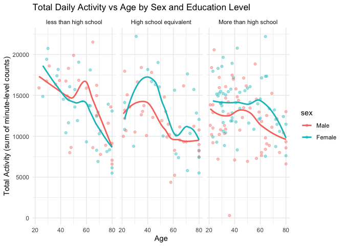

p8105_hw3_yz5248
================
yz5248
2025-10-05

``` r
library(p8105.datasets)
library(readr)
library(tidyverse)  
```

    ## ── Attaching core tidyverse packages ──────────────────────── tidyverse 2.0.0 ──
    ## ✔ dplyr     1.1.4     ✔ purrr     1.0.2
    ## ✔ forcats   1.0.0     ✔ stringr   1.5.1
    ## ✔ ggplot2   4.0.0     ✔ tibble    3.2.1
    ## ✔ lubridate 1.9.4     ✔ tidyr     1.3.1
    ## ── Conflicts ────────────────────────────────────────── tidyverse_conflicts() ──
    ## ✖ dplyr::filter() masks stats::filter()
    ## ✖ dplyr::lag()    masks stats::lag()
    ## ℹ Use the conflicted package (<http://conflicted.r-lib.org/>) to force all conflicts to become errors

``` r
library(scales)      
```

    ## 
    ## Attaching package: 'scales'
    ## 
    ## The following object is masked from 'package:purrr':
    ## 
    ##     discard
    ## 
    ## The following object is masked from 'package:readr':
    ## 
    ##     col_factor

``` r
library(knitr)
library(lubridate)
library(janitor)
```

    ## 
    ## Attaching package: 'janitor'
    ## 
    ## The following objects are masked from 'package:stats':
    ## 
    ##     chisq.test, fisher.test

``` r
library(patchwork)
library(ggplot2)
library(gt)
theme_set(theme_minimal(base_size = 14))
data("instacart")
```

# Problem 1

## number of aisles and the max term

``` r
n_aisles = 
  instacart |>
  distinct(aisle_id, aisle) |>
  nrow()
n_aisles   
```

    ## [1] 134

``` r
aisle_counts = 
  instacart |>
  count(aisle, sort = TRUE) |>
  rename(n_orders = n)

aisle_counts |>
  slice_head(n = 20) |> 
  knitr::kable()
```

| aisle                         | n_orders |
|:------------------------------|---------:|
| fresh vegetables              |   150609 |
| fresh fruits                  |   150473 |
| packaged vegetables fruits    |    78493 |
| yogurt                        |    55240 |
| packaged cheese               |    41699 |
| water seltzer sparkling water |    36617 |
| milk                          |    32644 |
| chips pretzels                |    31269 |
| soy lactosefree               |    26240 |
| bread                         |    23635 |
| refrigerated                  |    23228 |
| ice cream ice                 |    22676 |
| frozen produce                |    22453 |
| eggs                          |    19875 |
| crackers                      |    19592 |
| frozen meals                  |    18221 |
| energy granola bars           |    17449 |
| lunch meat                    |    16957 |
| soft drinks                   |    16279 |
| cereal                        |    16201 |

Here are totally 134 aisles.  
From the table we find that fresh vegetables is the most terms.

### the plot showing the number of items ordered in each aisle

``` r
aisle_counts |> 
  filter(n_orders > 10000) |> 
  mutate(aisle = fct_reorder(aisle, n_orders)) |> 
  ggplot(aes(x = aisle, y = n_orders)) +
  geom_col(fill = "blue") +
  coord_flip() +
  scale_y_continuous(labels = comma) +
  labs(
    title = "Aisles with more than 10,000 items ordered",
    x = "Aisle",
    y = "Number of items ordered"
  ) +
  theme_minimal(base_size = 13)
```

<!-- -->

## table showing the three most popular items

``` r
target_aisles = c("baking ingredients", "dog food care", "packaged vegetables fruits")

top3_items = 
  instacart |> 
  filter(aisle == target_aisles) |> 
  count(aisle, product_name, sort = TRUE) |> 
  group_by(aisle) |> 
  slice_head(n = 3) |> 
  ungroup()

top3_items |> 
  kable()
```

| aisle | product_name | n |
|:---|:---|---:|
| baking ingredients | Light Brown Sugar | 157 |
| baking ingredients | Pure Baking Soda | 140 |
| baking ingredients | Organic Vanilla Extract | 122 |
| dog food care | Organix Grain Free Chicken & Vegetable Dog Food | 14 |
| dog food care | Organix Chicken & Brown Rice Recipe | 13 |
| dog food care | Original Dry Dog | 9 |
| packaged vegetables fruits | Organic Baby Spinach | 3324 |
| packaged vegetables fruits | Organic Raspberries | 1920 |
| packaged vegetables fruits | Organic Blueberries | 1692 |

## table showing the mean hour of the day

``` r
weekday_labels = c("Sunday","Monday","Tuesday","Wednesday","Thursday","Friday","Saturday")

mean_hour = 
  instacart |>
  filter(product_name == c("Pink Lady Apples", "Coffee Ice Cream")) |>
  group_by(product_name, order_dow) |>
  summarise(mean_hour = mean(order_hour_of_day), .groups = "drop") |>
  mutate(weekday = factor(order_dow, levels = 0:6, labels = weekday_labels)) |>
  select(product_name, weekday, mean_hour) |>
  pivot_wider(names_from = weekday, values_from = mean_hour)
```

    ## Warning: There was 1 warning in `filter()`.
    ## ℹ In argument: `product_name == c("Pink Lady Apples", "Coffee Ice Cream")`.
    ## Caused by warning in `product_name == c("Pink Lady Apples", "Coffee Ice Cream")`:
    ## ! longer object length is not a multiple of shorter object length

``` r
mean_hour |>
  mutate(across(where(is.numeric), ~round(., 1))) |>
  kable()
```

| product_name     | Sunday | Monday | Tuesday | Wednesday | Thursday | Friday | Saturday |
|:-----------------|-------:|-------:|--------:|----------:|---------:|-------:|---------:|
| Coffee Ice Cream |   13.2 |   15.0 |    15.3 |      15.4 |     15.2 |   10.3 |     12.4 |
| Pink Lady Apples |   12.2 |   11.7 |    12.0 |      13.9 |     11.9 |   13.9 |     11.6 |

\#Problem 2

``` r
Zip_Codes = 
  read_csv("zillow_data/Zip Codes.csv") |>
  janitor::clean_names()|>
  view()
```

    ## Rows: 322 Columns: 7
    ## ── Column specification ────────────────────────────────────────────────────────
    ## Delimiter: ","
    ## chr (4): County, County Code, File Date, Neighborhood
    ## dbl (3): State FIPS, County FIPS, ZipCode
    ## 
    ## ℹ Use `spec()` to retrieve the full column specification for this data.
    ## ℹ Specify the column types or set `show_col_types = FALSE` to quiet this message.

``` r
Zip_zori = 
  read_csv("zillow_data/Zip_zori_uc_sfrcondomfr_sm_month_NYC.csv") |>
  janitor::clean_names()|>
  view()
```

    ## Rows: 149 Columns: 125
    ## ── Column specification ────────────────────────────────────────────────────────
    ## Delimiter: ","
    ## chr   (6): RegionType, StateName, State, City, Metro, CountyName
    ## dbl (119): RegionID, SizeRank, RegionName, 2015-01-31, 2015-02-28, 2015-03-3...
    ## 
    ## ℹ Use `spec()` to retrieve the full column specification for this data.
    ## ℹ Specify the column types or set `show_col_types = FALSE` to quiet this message.

``` r
zip_counts <- Zip_Codes |>
  group_by(zip_code) |>
  summarise(n_obs = n()) |>
  arrange(desc(n_obs)) |>
  summarise(
    full_coverage = sum(n_obs == 116),
    sparse_coverage = sum(n_obs < 10)
  )
zip_counts
```

    ## # A tibble: 1 × 2
    ##   full_coverage sparse_coverage
    ##           <int>           <int>
    ## 1             0             320

From the table, we can find that there are 0 ZIP codes are observed 116
times and 320 ZIP codes are observed fewer than 10 times.  
The reason why some ZIP codes are observed rarely and others observed in
each month may are:  
1. Different population density and housing activity among variable
locations; 2. Missing data, the information of some areas is hard to
collect.

## table showing the average rental price in each borough and year

``` r
zip_df = 
  Zip_Codes |> 
  transmute(                      
    zip = as.character(zip_code), 
    borough = case_when(          
      str_detect(county, "New York") ~ "Manhattan",
      str_detect(county, "Kings") ~ "Brooklyn",
      str_detect(county, "Queens") ~ "Queens",
      str_detect(county, "Bronx") ~ "Bronx",
      str_detect(county, "Richmond") ~ "Staten Island",
      TRUE ~ "Other"
    )
  )

rent_df =
  Zip_zori |>
  select(region_name, starts_with("x")) |>   
  rename(zip = region_name) |>
  pivot_longer(
    cols = starts_with("x"),
    names_to = "month_raw",
    values_to = "rent"
  ) |>
  mutate(
    month = str_remove(month_raw, "^x"),
    month = str_replace_all(month, "_", "-"),
    month = ymd(month),
    zip = as.character(zip),
    rent = as.numeric(rent)
  ) |>
  select(zip, month, rent) |>
  drop_na(rent)|>
  view()

rent_with_borough = rent_df |>
  left_join(zip_df, by = "zip")
```

    ## Warning in left_join(rent_df, zip_df, by = "zip"): Detected an unexpected many-to-many relationship between `x` and `y`.
    ## ℹ Row 2759 of `x` matches multiple rows in `y`.
    ## ℹ Row 256 of `y` matches multiple rows in `x`.
    ## ℹ If a many-to-many relationship is expected, set `relationship =
    ##   "many-to-many"` to silence this warning.

``` r
borough_year =
  rent_with_borough |>
  filter(!is.na(borough)) |>
  mutate(year = year(month)) |>
  group_by(borough, year) |>
  summarise(
    mean_rent = mean(rent, na.rm = TRUE),
    n = n(),
    .groups = "drop"
  ) |>
  arrange(borough, year)

borough_year_table =
  borough_year |>
  mutate(mean_fmt = paste0("$", comma(round(mean_rent, 0)), " (n=", n, ")")) |>
  select(borough, year, mean_fmt) |>
  pivot_wider(
    names_from = year,
    values_from = mean_fmt
  ) |>
  arrange(borough) |>
  gt() |>   
  tab_header(
    title = "Average Rental Price by Borough and Year",
    subtitle = "Monthly average rental prices (2015–2024)"
  ) |>
  tab_options(
    table.font.names = "Helvetica",
    table.font.size = 12,
    table.align = "center",
    data_row.padding = px(5),
    heading.align = "center"
  ) |>
  cols_label(
    borough = "Borough"
  )

borough_year_table
```

<div id="ozdlegufyp" style="padding-left:0px;padding-right:0px;padding-top:10px;padding-bottom:10px;overflow-x:auto;overflow-y:auto;width:auto;height:auto;">
<style>#ozdlegufyp table {
  font-family: Helvetica;
  -webkit-font-smoothing: antialiased;
  -moz-osx-font-smoothing: grayscale;
}
&#10;#ozdlegufyp thead, #ozdlegufyp tbody, #ozdlegufyp tfoot, #ozdlegufyp tr, #ozdlegufyp td, #ozdlegufyp th {
  border-style: none;
}
&#10;#ozdlegufyp p {
  margin: 0;
  padding: 0;
}
&#10;#ozdlegufyp .gt_table {
  display: table;
  border-collapse: collapse;
  line-height: normal;
  margin-left: auto;
  margin-right: auto;
  color: #333333;
  font-size: 12px;
  font-weight: normal;
  font-style: normal;
  background-color: #FFFFFF;
  width: auto;
  border-top-style: solid;
  border-top-width: 2px;
  border-top-color: #A8A8A8;
  border-right-style: none;
  border-right-width: 2px;
  border-right-color: #D3D3D3;
  border-bottom-style: solid;
  border-bottom-width: 2px;
  border-bottom-color: #A8A8A8;
  border-left-style: none;
  border-left-width: 2px;
  border-left-color: #D3D3D3;
}
&#10;#ozdlegufyp .gt_caption {
  padding-top: 4px;
  padding-bottom: 4px;
}
&#10;#ozdlegufyp .gt_title {
  color: #333333;
  font-size: 125%;
  font-weight: initial;
  padding-top: 4px;
  padding-bottom: 4px;
  padding-left: 5px;
  padding-right: 5px;
  border-bottom-color: #FFFFFF;
  border-bottom-width: 0;
}
&#10;#ozdlegufyp .gt_subtitle {
  color: #333333;
  font-size: 85%;
  font-weight: initial;
  padding-top: 3px;
  padding-bottom: 5px;
  padding-left: 5px;
  padding-right: 5px;
  border-top-color: #FFFFFF;
  border-top-width: 0;
}
&#10;#ozdlegufyp .gt_heading {
  background-color: #FFFFFF;
  text-align: center;
  border-bottom-color: #FFFFFF;
  border-left-style: none;
  border-left-width: 1px;
  border-left-color: #D3D3D3;
  border-right-style: none;
  border-right-width: 1px;
  border-right-color: #D3D3D3;
}
&#10;#ozdlegufyp .gt_bottom_border {
  border-bottom-style: solid;
  border-bottom-width: 2px;
  border-bottom-color: #D3D3D3;
}
&#10;#ozdlegufyp .gt_col_headings {
  border-top-style: solid;
  border-top-width: 2px;
  border-top-color: #D3D3D3;
  border-bottom-style: solid;
  border-bottom-width: 2px;
  border-bottom-color: #D3D3D3;
  border-left-style: none;
  border-left-width: 1px;
  border-left-color: #D3D3D3;
  border-right-style: none;
  border-right-width: 1px;
  border-right-color: #D3D3D3;
}
&#10;#ozdlegufyp .gt_col_heading {
  color: #333333;
  background-color: #FFFFFF;
  font-size: 100%;
  font-weight: normal;
  text-transform: inherit;
  border-left-style: none;
  border-left-width: 1px;
  border-left-color: #D3D3D3;
  border-right-style: none;
  border-right-width: 1px;
  border-right-color: #D3D3D3;
  vertical-align: bottom;
  padding-top: 5px;
  padding-bottom: 6px;
  padding-left: 5px;
  padding-right: 5px;
  overflow-x: hidden;
}
&#10;#ozdlegufyp .gt_column_spanner_outer {
  color: #333333;
  background-color: #FFFFFF;
  font-size: 100%;
  font-weight: normal;
  text-transform: inherit;
  padding-top: 0;
  padding-bottom: 0;
  padding-left: 4px;
  padding-right: 4px;
}
&#10;#ozdlegufyp .gt_column_spanner_outer:first-child {
  padding-left: 0;
}
&#10;#ozdlegufyp .gt_column_spanner_outer:last-child {
  padding-right: 0;
}
&#10;#ozdlegufyp .gt_column_spanner {
  border-bottom-style: solid;
  border-bottom-width: 2px;
  border-bottom-color: #D3D3D3;
  vertical-align: bottom;
  padding-top: 5px;
  padding-bottom: 5px;
  overflow-x: hidden;
  display: inline-block;
  width: 100%;
}
&#10;#ozdlegufyp .gt_spanner_row {
  border-bottom-style: hidden;
}
&#10;#ozdlegufyp .gt_group_heading {
  padding-top: 8px;
  padding-bottom: 8px;
  padding-left: 5px;
  padding-right: 5px;
  color: #333333;
  background-color: #FFFFFF;
  font-size: 100%;
  font-weight: initial;
  text-transform: inherit;
  border-top-style: solid;
  border-top-width: 2px;
  border-top-color: #D3D3D3;
  border-bottom-style: solid;
  border-bottom-width: 2px;
  border-bottom-color: #D3D3D3;
  border-left-style: none;
  border-left-width: 1px;
  border-left-color: #D3D3D3;
  border-right-style: none;
  border-right-width: 1px;
  border-right-color: #D3D3D3;
  vertical-align: middle;
  text-align: left;
}
&#10;#ozdlegufyp .gt_empty_group_heading {
  padding: 0.5px;
  color: #333333;
  background-color: #FFFFFF;
  font-size: 100%;
  font-weight: initial;
  border-top-style: solid;
  border-top-width: 2px;
  border-top-color: #D3D3D3;
  border-bottom-style: solid;
  border-bottom-width: 2px;
  border-bottom-color: #D3D3D3;
  vertical-align: middle;
}
&#10;#ozdlegufyp .gt_from_md > :first-child {
  margin-top: 0;
}
&#10;#ozdlegufyp .gt_from_md > :last-child {
  margin-bottom: 0;
}
&#10;#ozdlegufyp .gt_row {
  padding-top: 5px;
  padding-bottom: 5px;
  padding-left: 5px;
  padding-right: 5px;
  margin: 10px;
  border-top-style: solid;
  border-top-width: 1px;
  border-top-color: #D3D3D3;
  border-left-style: none;
  border-left-width: 1px;
  border-left-color: #D3D3D3;
  border-right-style: none;
  border-right-width: 1px;
  border-right-color: #D3D3D3;
  vertical-align: middle;
  overflow-x: hidden;
}
&#10;#ozdlegufyp .gt_stub {
  color: #333333;
  background-color: #FFFFFF;
  font-size: 100%;
  font-weight: initial;
  text-transform: inherit;
  border-right-style: solid;
  border-right-width: 2px;
  border-right-color: #D3D3D3;
  padding-left: 5px;
  padding-right: 5px;
}
&#10;#ozdlegufyp .gt_stub_row_group {
  color: #333333;
  background-color: #FFFFFF;
  font-size: 100%;
  font-weight: initial;
  text-transform: inherit;
  border-right-style: solid;
  border-right-width: 2px;
  border-right-color: #D3D3D3;
  padding-left: 5px;
  padding-right: 5px;
  vertical-align: top;
}
&#10;#ozdlegufyp .gt_row_group_first td {
  border-top-width: 2px;
}
&#10;#ozdlegufyp .gt_row_group_first th {
  border-top-width: 2px;
}
&#10;#ozdlegufyp .gt_summary_row {
  color: #333333;
  background-color: #FFFFFF;
  text-transform: inherit;
  padding-top: 8px;
  padding-bottom: 8px;
  padding-left: 5px;
  padding-right: 5px;
}
&#10;#ozdlegufyp .gt_first_summary_row {
  border-top-style: solid;
  border-top-color: #D3D3D3;
}
&#10;#ozdlegufyp .gt_first_summary_row.thick {
  border-top-width: 2px;
}
&#10;#ozdlegufyp .gt_last_summary_row {
  padding-top: 8px;
  padding-bottom: 8px;
  padding-left: 5px;
  padding-right: 5px;
  border-bottom-style: solid;
  border-bottom-width: 2px;
  border-bottom-color: #D3D3D3;
}
&#10;#ozdlegufyp .gt_grand_summary_row {
  color: #333333;
  background-color: #FFFFFF;
  text-transform: inherit;
  padding-top: 8px;
  padding-bottom: 8px;
  padding-left: 5px;
  padding-right: 5px;
}
&#10;#ozdlegufyp .gt_first_grand_summary_row {
  padding-top: 8px;
  padding-bottom: 8px;
  padding-left: 5px;
  padding-right: 5px;
  border-top-style: double;
  border-top-width: 6px;
  border-top-color: #D3D3D3;
}
&#10;#ozdlegufyp .gt_last_grand_summary_row_top {
  padding-top: 8px;
  padding-bottom: 8px;
  padding-left: 5px;
  padding-right: 5px;
  border-bottom-style: double;
  border-bottom-width: 6px;
  border-bottom-color: #D3D3D3;
}
&#10;#ozdlegufyp .gt_striped {
  background-color: rgba(128, 128, 128, 0.05);
}
&#10;#ozdlegufyp .gt_table_body {
  border-top-style: solid;
  border-top-width: 2px;
  border-top-color: #D3D3D3;
  border-bottom-style: solid;
  border-bottom-width: 2px;
  border-bottom-color: #D3D3D3;
}
&#10;#ozdlegufyp .gt_footnotes {
  color: #333333;
  background-color: #FFFFFF;
  border-bottom-style: none;
  border-bottom-width: 2px;
  border-bottom-color: #D3D3D3;
  border-left-style: none;
  border-left-width: 2px;
  border-left-color: #D3D3D3;
  border-right-style: none;
  border-right-width: 2px;
  border-right-color: #D3D3D3;
}
&#10;#ozdlegufyp .gt_footnote {
  margin: 0px;
  font-size: 90%;
  padding-top: 4px;
  padding-bottom: 4px;
  padding-left: 5px;
  padding-right: 5px;
}
&#10;#ozdlegufyp .gt_sourcenotes {
  color: #333333;
  background-color: #FFFFFF;
  border-bottom-style: none;
  border-bottom-width: 2px;
  border-bottom-color: #D3D3D3;
  border-left-style: none;
  border-left-width: 2px;
  border-left-color: #D3D3D3;
  border-right-style: none;
  border-right-width: 2px;
  border-right-color: #D3D3D3;
}
&#10;#ozdlegufyp .gt_sourcenote {
  font-size: 90%;
  padding-top: 4px;
  padding-bottom: 4px;
  padding-left: 5px;
  padding-right: 5px;
}
&#10;#ozdlegufyp .gt_left {
  text-align: left;
}
&#10;#ozdlegufyp .gt_center {
  text-align: center;
}
&#10;#ozdlegufyp .gt_right {
  text-align: right;
  font-variant-numeric: tabular-nums;
}
&#10;#ozdlegufyp .gt_font_normal {
  font-weight: normal;
}
&#10;#ozdlegufyp .gt_font_bold {
  font-weight: bold;
}
&#10;#ozdlegufyp .gt_font_italic {
  font-style: italic;
}
&#10;#ozdlegufyp .gt_super {
  font-size: 65%;
}
&#10;#ozdlegufyp .gt_footnote_marks {
  font-size: 75%;
  vertical-align: 0.4em;
  position: initial;
}
&#10;#ozdlegufyp .gt_asterisk {
  font-size: 100%;
  vertical-align: 0;
}
&#10;#ozdlegufyp .gt_indent_1 {
  text-indent: 5px;
}
&#10;#ozdlegufyp .gt_indent_2 {
  text-indent: 10px;
}
&#10;#ozdlegufyp .gt_indent_3 {
  text-indent: 15px;
}
&#10;#ozdlegufyp .gt_indent_4 {
  text-indent: 20px;
}
&#10;#ozdlegufyp .gt_indent_5 {
  text-indent: 25px;
}
&#10;#ozdlegufyp .katex-display {
  display: inline-flex !important;
  margin-bottom: 0.75em !important;
}
&#10;#ozdlegufyp div.Reactable > div.rt-table > div.rt-thead > div.rt-tr.rt-tr-group-header > div.rt-th-group:after {
  height: 0px !important;
}
</style>
<table class="gt_table" data-quarto-disable-processing="false" data-quarto-bootstrap="false">
  <thead>
    <tr class="gt_heading">
      <td colspan="11" class="gt_heading gt_title gt_font_normal" style>Average Rental Price by Borough and Year</td>
    </tr>
    <tr class="gt_heading">
      <td colspan="11" class="gt_heading gt_subtitle gt_font_normal gt_bottom_border" style>Monthly average rental prices (2015–2024)</td>
    </tr>
    <tr class="gt_col_headings">
      <th class="gt_col_heading gt_columns_bottom_border gt_left" rowspan="1" colspan="1" scope="col" id="borough">Borough</th>
      <th class="gt_col_heading gt_columns_bottom_border gt_left" rowspan="1" colspan="1" scope="col" id="a2015">2015</th>
      <th class="gt_col_heading gt_columns_bottom_border gt_left" rowspan="1" colspan="1" scope="col" id="a2016">2016</th>
      <th class="gt_col_heading gt_columns_bottom_border gt_left" rowspan="1" colspan="1" scope="col" id="a2017">2017</th>
      <th class="gt_col_heading gt_columns_bottom_border gt_left" rowspan="1" colspan="1" scope="col" id="a2018">2018</th>
      <th class="gt_col_heading gt_columns_bottom_border gt_left" rowspan="1" colspan="1" scope="col" id="a2019">2019</th>
      <th class="gt_col_heading gt_columns_bottom_border gt_left" rowspan="1" colspan="1" scope="col" id="a2020">2020</th>
      <th class="gt_col_heading gt_columns_bottom_border gt_left" rowspan="1" colspan="1" scope="col" id="a2021">2021</th>
      <th class="gt_col_heading gt_columns_bottom_border gt_left" rowspan="1" colspan="1" scope="col" id="a2022">2022</th>
      <th class="gt_col_heading gt_columns_bottom_border gt_left" rowspan="1" colspan="1" scope="col" id="a2023">2023</th>
      <th class="gt_col_heading gt_columns_bottom_border gt_left" rowspan="1" colspan="1" scope="col" id="a2024">2024</th>
    </tr>
  </thead>
  <tbody class="gt_table_body">
    <tr><td headers="borough" class="gt_row gt_left">Bronx</td>
<td headers="2015" class="gt_row gt_left">$1,760 (n=8)</td>
<td headers="2016" class="gt_row gt_left">$1,520 (n=30)</td>
<td headers="2017" class="gt_row gt_left">$1,544 (n=46)</td>
<td headers="2018" class="gt_row gt_left">$1,639 (n=59)</td>
<td headers="2019" class="gt_row gt_left">$1,706 (n=59)</td>
<td headers="2020" class="gt_row gt_left">$1,811 (n=71)</td>
<td headers="2021" class="gt_row gt_left">$1,858 (n=80)</td>
<td headers="2022" class="gt_row gt_left">$2,054 (n=110)</td>
<td headers="2023" class="gt_row gt_left">$2,285 (n=144)</td>
<td headers="2024" class="gt_row gt_left">$2,497 (n=126)</td></tr>
    <tr><td headers="borough" class="gt_row gt_left">Brooklyn</td>
<td headers="2015" class="gt_row gt_left">$2,493 (n=238)</td>
<td headers="2016" class="gt_row gt_left">$2,520 (n=256)</td>
<td headers="2017" class="gt_row gt_left">$2,546 (n=265)</td>
<td headers="2018" class="gt_row gt_left">$2,547 (n=288)</td>
<td headers="2019" class="gt_row gt_left">$2,631 (n=298)</td>
<td headers="2020" class="gt_row gt_left">$2,555 (n=327)</td>
<td headers="2021" class="gt_row gt_left">$2,550 (n=352)</td>
<td headers="2022" class="gt_row gt_left">$2,868 (n=400)</td>
<td headers="2023" class="gt_row gt_left">$3,015 (n=417)</td>
<td headers="2024" class="gt_row gt_left">$3,126 (n=285)</td></tr>
    <tr><td headers="borough" class="gt_row gt_left">Manhattan</td>
<td headers="2015" class="gt_row gt_left">$3,006 (n=420)</td>
<td headers="2016" class="gt_row gt_left">$3,015 (n=452)</td>
<td headers="2017" class="gt_row gt_left">$3,109 (n=480)</td>
<td headers="2018" class="gt_row gt_left">$3,160 (n=480)</td>
<td headers="2019" class="gt_row gt_left">$3,285 (n=492)</td>
<td headers="2020" class="gt_row gt_left">$3,091 (n=513)</td>
<td headers="2021" class="gt_row gt_left">$3,124 (n=531)</td>
<td headers="2022" class="gt_row gt_left">$3,753 (n=540)</td>
<td headers="2023" class="gt_row gt_left">$3,908 (n=541)</td>
<td headers="2024" class="gt_row gt_left">$4,053 (n=370)</td></tr>
    <tr><td headers="borough" class="gt_row gt_left">Queens</td>
<td headers="2015" class="gt_row gt_left">$2,215 (n=65)</td>
<td headers="2016" class="gt_row gt_left">$2,272 (n=108)</td>
<td headers="2017" class="gt_row gt_left">$2,263 (n=132)</td>
<td headers="2018" class="gt_row gt_left">$2,292 (n=132)</td>
<td headers="2019" class="gt_row gt_left">$2,388 (n=132)</td>
<td headers="2020" class="gt_row gt_left">$2,316 (n=161)</td>
<td headers="2021" class="gt_row gt_left">$2,211 (n=234)</td>
<td headers="2022" class="gt_row gt_left">$2,406 (n=275)</td>
<td headers="2023" class="gt_row gt_left">$2,562 (n=307)</td>
<td headers="2024" class="gt_row gt_left">$2,694 (n=242)</td></tr>
    <tr><td headers="borough" class="gt_row gt_left">Staten Island</td>
<td headers="2015" class="gt_row gt_left">NA</td>
<td headers="2016" class="gt_row gt_left">NA</td>
<td headers="2017" class="gt_row gt_left">NA</td>
<td headers="2018" class="gt_row gt_left">NA</td>
<td headers="2019" class="gt_row gt_left">NA</td>
<td headers="2020" class="gt_row gt_left">$1,978 (n=5)</td>
<td headers="2021" class="gt_row gt_left">$2,045 (n=27)</td>
<td headers="2022" class="gt_row gt_left">$2,147 (n=57)</td>
<td headers="2023" class="gt_row gt_left">$2,333 (n=70)</td>
<td headers="2024" class="gt_row gt_left">$2,536 (n=52)</td></tr>
  </tbody>
  &#10;</table>
</div>

From the table, we can find that:

## plot showing NYC Rental Prices within ZIP codes

``` r
rent_tidy = 
  left_join(rent_df, zip_df, by = "zip") |>
  rename(Year = month) |>
  view()
```

    ## Warning in left_join(rent_df, zip_df, by = "zip"): Detected an unexpected many-to-many relationship between `x` and `y`.
    ## ℹ Row 2759 of `x` matches multiple rows in `y`.
    ## ℹ Row 256 of `y` matches multiple rows in `x`.
    ## ℹ If a many-to-many relationship is expected, set `relationship =
    ##   "many-to-many"` to silence this warning.

``` r
rent_summary =
  rent_tidy |>
  mutate(Year = year(Year)) |>    
  group_by(borough, Year) |>
  summarise(mean_rent = mean(rent, na.rm = TRUE)) |>
  arrange(borough, Year) 
```

    ## `summarise()` has grouped output by 'borough'. You can override using the
    ## `.groups` argument.

``` r
rent_summary |>
  knitr::kable(
    caption = "Average Rental Price by Borough and Year (Zillow ZORI Data)",
    digits = 0
  ) 
```

| borough       | Year | mean_rent |
|:--------------|-----:|----------:|
| Bronx         | 2015 |      1760 |
| Bronx         | 2016 |      1520 |
| Bronx         | 2017 |      1544 |
| Bronx         | 2018 |      1639 |
| Bronx         | 2019 |      1706 |
| Bronx         | 2020 |      1811 |
| Bronx         | 2021 |      1858 |
| Bronx         | 2022 |      2054 |
| Bronx         | 2023 |      2285 |
| Bronx         | 2024 |      2497 |
| Brooklyn      | 2015 |      2493 |
| Brooklyn      | 2016 |      2520 |
| Brooklyn      | 2017 |      2546 |
| Brooklyn      | 2018 |      2547 |
| Brooklyn      | 2019 |      2631 |
| Brooklyn      | 2020 |      2555 |
| Brooklyn      | 2021 |      2550 |
| Brooklyn      | 2022 |      2868 |
| Brooklyn      | 2023 |      3015 |
| Brooklyn      | 2024 |      3126 |
| Manhattan     | 2015 |      3006 |
| Manhattan     | 2016 |      3015 |
| Manhattan     | 2017 |      3109 |
| Manhattan     | 2018 |      3160 |
| Manhattan     | 2019 |      3285 |
| Manhattan     | 2020 |      3091 |
| Manhattan     | 2021 |      3124 |
| Manhattan     | 2022 |      3753 |
| Manhattan     | 2023 |      3908 |
| Manhattan     | 2024 |      4053 |
| Queens        | 2015 |      2215 |
| Queens        | 2016 |      2272 |
| Queens        | 2017 |      2263 |
| Queens        | 2018 |      2292 |
| Queens        | 2019 |      2388 |
| Queens        | 2020 |      2316 |
| Queens        | 2021 |      2211 |
| Queens        | 2022 |      2406 |
| Queens        | 2023 |      2562 |
| Queens        | 2024 |      2694 |
| Staten Island | 2020 |      1978 |
| Staten Island | 2021 |      2045 |
| Staten Island | 2022 |      2147 |
| Staten Island | 2023 |      2333 |
| Staten Island | 2024 |      2536 |

Average Rental Price by Borough and Year (Zillow ZORI Data)

``` r
plot_trend = ggplot(rent_tidy, aes(x = Year, y = rent, group = zip)) +
  geom_line(aes(color = borough), alpha = 0.3, size = 0.6) +
  facet_wrap(~ borough, scales = "free_y") +  
  labs(
    title = "NYC Rental Prices by ZIP Code and Borough (Zillow ZORI Data)",
    x = "Year",
    y = "Rental Price (USD)",
    color = "Borough"
  ) +
  theme_minimal(base_size = 14) +
  theme(
    legend.position = "none",
    strip.text = element_text(face = "bold", size = 13)
  )
```

    ## Warning: Using `size` aesthetic for lines was deprecated in ggplot2 3.4.0.
    ## ℹ Please use `linewidth` instead.
    ## This warning is displayed once every 8 hours.
    ## Call `lifecycle::last_lifecycle_warnings()` to see where this warning was
    ## generated.

``` r
plot_trend
```

<!-- -->

## About 2023

``` r
rent_2023 = rent_tidy |>
  filter(year(Year) == 2023)


zip_mean_2023 = rent_2023 |>
  group_by(borough, zip) |>
  summarise(mean_rent = mean(rent, na.rm = TRUE), .groups = "drop")|>
  ggplot(aes(x = borough, y = mean_rent, fill = borough)) +
  geom_boxplot(alpha = 0.8, outlier.color = "red", outlier.shape = 1) +
  geom_jitter(width = 0.2, alpha = 0.4, color = "black") + 
  labs(
    title = "Distribution of Average ZIP-Code-Level Rents in 2023",
    subtitle = "Comparison across NYC boroughs (Zillow ZORI Data)",
    x = "Borough",
    y = "Average Monthly Rent (USD)"
  ) +
  theme_minimal(base_size = 14) +
  theme(
    legend.position = "none",
    plot.title = element_text(face = "bold", size = 16),
    plot.subtitle = element_text(size = 13),
    axis.text.x = element_text(face = "bold")
  )
zip_mean_2023
```

<!-- -->

## Combination of the two plots

``` r
combined_plot = plot_trend / zip_mean_2023 +
  plot_annotation(
    title = "NYC Rental Prices: Trends and 2023 Distributions",
    theme = theme(plot.title = element_text(face = "bold", size = 18))
  )

combined_plot
```

<!-- -->

``` r
ggsave("results/nyc_rental_combined_plot.png",
       combined_plot,
       width = 12, height = 10, dpi = 300)
```

\#Problem 3

``` r
nhanes_covar = 
  read_csv("nhanes_covar.csv",skip = 4) |> 
  janitor::clean_names() |>
  view()
```

    ## Rows: 250 Columns: 5
    ## ── Column specification ────────────────────────────────────────────────────────
    ## Delimiter: ","
    ## dbl (5): SEQN, sex, age, BMI, education
    ## 
    ## ℹ Use `spec()` to retrieve the full column specification for this data.
    ## ℹ Specify the column types or set `show_col_types = FALSE` to quiet this message.

``` r
nhanes_accel = 
  read_csv("nhanes_accel.csv") |> 
  janitor::clean_names() |>
  view()
```

    ## Rows: 250 Columns: 1441
    ## ── Column specification ────────────────────────────────────────────────────────
    ## Delimiter: ","
    ## dbl (1441): SEQN, min1, min2, min3, min4, min5, min6, min7, min8, min9, min1...
    ## 
    ## ℹ Use `spec()` to retrieve the full column specification for this data.
    ## ℹ Specify the column types or set `show_col_types = FALSE` to quiet this message.

``` r
nhanes_full = 
  left_join(nhanes_covar, nhanes_accel, by = "seqn")|>
  view()
```

``` r
nhanes_clean = nhanes_full |>
  filter(age >= 21) |>
  drop_na(sex, bmi, education) |> 
  mutate(
    sex = factor(sex, 
                 levels = c(1, 2),
                 labels = c("Male", "Female")),
    education = factor(education,
                       levels = c(1, 2, 3),
                       labels = c("less than high school",
                                  "High school equivalent",
                                  "More than high school")
                       ),
  )
```

``` r
edu_gender_table = nhanes_clean |>
  count(education, sex) |>
  pivot_wider(
    names_from = sex, 
    values_from = n, 
    values_fill = 0
  ) |>
  mutate(Total = Male + Female) |>
  kable(
    caption = "Number of Men and Women by Education Level (NHANES Sample)",
    align = "lccc"
  )
edu_gender_table
```

| education              | Male | Female | Total |
|:-----------------------|:----:|:------:|:-----:|
| less than high school  |  27  |   28   |  55   |
| High school equivalent |  35  |   23   |  58   |
| More than high school  |  56  |   59   |  115  |

Number of Men and Women by Education Level (NHANES Sample)

``` r
sex_education = 
  ggplot(nhanes_clean, aes(x = education, y = age, fill = sex)) +
  geom_boxplot(width = 0.15, position = position_dodge(0.9), outlier.shape = NA, alpha = 0.5) +
  labs(
    title = "Age Distributions by Education Level and Sex",
    subtitle = "NHANES Accelerometer Sample (Age ≥ 21)",
    x = "Education Level",
    y = "Age (years)",
    fill = "Sex"
  ) +
  theme_minimal(base_size = 14) +
  theme(
    axis.text.x = element_text(angle = 20, hjust = 1, face = "bold"),
    plot.title = element_text(face = "bold", size = 16),
    legend.position = "top"
  )
sex_education
```

<!-- -->

``` r
total_activity = nhanes_clean |>
  mutate(total_activity = rowSums(select(cur_data(), starts_with("min")), na.rm = TRUE)) |>
  select(seqn, sex, age, education, total_activity) |>
  view()
```

    ## Warning: There was 1 warning in `mutate()`.
    ## ℹ In argument: `total_activity = rowSums(select(cur_data(),
    ##   starts_with("min")), na.rm = TRUE)`.
    ## Caused by warning:
    ## ! `cur_data()` was deprecated in dplyr 1.1.0.
    ## ℹ Please use `pick()` instead.

``` r
activity_plot = 
  ggplot(total_activity, aes(x = age, y = total_activity, color = sex)) +
  geom_point(alpha = 0.4) +
  geom_smooth(method = "loess", se = FALSE) +
  facet_wrap(~education) +
  labs(
    x = "Age",
    y = "Total Activity (sum of minute-level counts)",
    title = "Total Daily Activity vs Age by Sex and Education Level"
  ) +
  theme_minimal()
activity_plot
```

    ## `geom_smooth()` using formula = 'y ~ x'

<!-- -->

``` r
nhanes_daylong = nhanes_clean |>
  pivot_longer(
    cols = starts_with("min"),
    names_to = "minute",
    values_to = "activity"
  ) |>
  mutate(
    minute = as.numeric(gsub("min", "", minute)),   
    hour = minute / 60                             
  )
nhanes_daylong
```

    ## # A tibble: 328,320 × 8
    ##     seqn sex     age   bmi education              minute activity   hour
    ##    <dbl> <fct> <dbl> <dbl> <fct>                   <dbl>    <dbl>  <dbl>
    ##  1 62161 Male     22  23.3 High school equivalent      1    1.11  0.0167
    ##  2 62161 Male     22  23.3 High school equivalent      2    3.12  0.0333
    ##  3 62161 Male     22  23.3 High school equivalent      3    1.47  0.05  
    ##  4 62161 Male     22  23.3 High school equivalent      4    0.938 0.0667
    ##  5 62161 Male     22  23.3 High school equivalent      5    1.60  0.0833
    ##  6 62161 Male     22  23.3 High school equivalent      6    0.145 0.1   
    ##  7 62161 Male     22  23.3 High school equivalent      7    2.10  0.117 
    ##  8 62161 Male     22  23.3 High school equivalent      8    0.509 0.133 
    ##  9 62161 Male     22  23.3 High school equivalent      9    1.63  0.15  
    ## 10 62161 Male     22  23.3 High school equivalent     10    1.20  0.167 
    ## # ℹ 328,310 more rows

``` r
daylong_plot = 
  ggplot(nhanes_daylong, aes(x = hour, y = activity, color = sex)) +
  geom_smooth(se = FALSE, span = 0.2) +   
  facet_wrap(~education) +
  labs(
    title = "24-hour Activity Patterns by Education Level and Sex",
    x = "Hour of Day",
    y = "Activity Count (Accelerometer)",
    color = "Sex"
  ) +
  theme_minimal() +
  theme(
    legend.position = "bottom",
    panel.grid.minor = element_blank()
  )
daylong_plot
```

    ## `geom_smooth()` using method = 'gam' and formula = 'y ~ s(x, bs = "cs")'

<!-- -->
