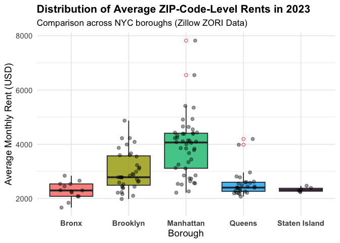

p8105_hw3_yz5248
================
yz5248
2025-10-05

``` r
library(p8105.datasets)
library(readr)
library(tidyverse)  
```

    ## ── Attaching core tidyverse packages ──────────────────────── tidyverse 2.0.0 ──
    ## ✔ dplyr     1.1.4     ✔ purrr     1.0.2
    ## ✔ forcats   1.0.0     ✔ stringr   1.5.1
    ## ✔ ggplot2   4.0.0     ✔ tibble    3.2.1
    ## ✔ lubridate 1.9.4     ✔ tidyr     1.3.1
    ## ── Conflicts ────────────────────────────────────────── tidyverse_conflicts() ──
    ## ✖ dplyr::filter() masks stats::filter()
    ## ✖ dplyr::lag()    masks stats::lag()
    ## ℹ Use the conflicted package (<http://conflicted.r-lib.org/>) to force all conflicts to become errors

``` r
library(scales)      
```

    ## 
    ## Attaching package: 'scales'
    ## 
    ## The following object is masked from 'package:purrr':
    ## 
    ##     discard
    ## 
    ## The following object is masked from 'package:readr':
    ## 
    ##     col_factor

``` r
library(knitr)
library(lubridate)
library(janitor)
```

    ## 
    ## Attaching package: 'janitor'
    ## 
    ## The following objects are masked from 'package:stats':
    ## 
    ##     chisq.test, fisher.test

``` r
library(patchwork)
library(ggplot2)
theme_set(theme_minimal(base_size = 14))
data("instacart")
```

\#Problem 1

``` r
n_aisles = 
  instacart |>
  distinct(aisle_id, aisle) |>
  nrow()
n_aisles   
```

    ## [1] 134

``` r
aisle_counts = 
  instacart |>
  count(aisle, sort = TRUE) |>
  rename(n_orders = n)

aisle_counts |>
  slice_head(n = 20) |> 
  knitr::kable()
```

| aisle                         | n_orders |
|:------------------------------|---------:|
| fresh vegetables              |   150609 |
| fresh fruits                  |   150473 |
| packaged vegetables fruits    |    78493 |
| yogurt                        |    55240 |
| packaged cheese               |    41699 |
| water seltzer sparkling water |    36617 |
| milk                          |    32644 |
| chips pretzels                |    31269 |
| soy lactosefree               |    26240 |
| bread                         |    23635 |
| refrigerated                  |    23228 |
| ice cream ice                 |    22676 |
| frozen produce                |    22453 |
| eggs                          |    19875 |
| crackers                      |    19592 |
| frozen meals                  |    18221 |
| energy granola bars           |    17449 |
| lunch meat                    |    16957 |
| soft drinks                   |    16279 |
| cereal                        |    16201 |

``` r
aisle_counts |> 
  filter(n_orders > 10000) |> 
  mutate(aisle = fct_reorder(aisle, n_orders)) |> 
  ggplot(aes(x = aisle, y = n_orders)) +
  geom_col(fill = "blue") +
  coord_flip() +
  scale_y_continuous(labels = comma) +
  labs(
    title = "Aisles with more than 10,000 items ordered",
    x = "Aisle",
    y = "Number of items ordered"
  ) +
  theme_minimal(base_size = 13)
```

<!-- -->

``` r
target_aisles = c("baking ingredients", "dog food care", "packaged vegetables fruits")

top3_items = 
  instacart |> 
  filter(aisle == target_aisles) |> 
  count(aisle, product_name, sort = TRUE) |> 
  group_by(aisle) |> 
  slice_head(n = 3) |> 
  ungroup()

top3_items |> 
  kable()
```

| aisle | product_name | n |
|:---|:---|---:|
| baking ingredients | Light Brown Sugar | 157 |
| baking ingredients | Pure Baking Soda | 140 |
| baking ingredients | Organic Vanilla Extract | 122 |
| dog food care | Organix Grain Free Chicken & Vegetable Dog Food | 14 |
| dog food care | Organix Chicken & Brown Rice Recipe | 13 |
| dog food care | Original Dry Dog | 9 |
| packaged vegetables fruits | Organic Baby Spinach | 3324 |
| packaged vegetables fruits | Organic Raspberries | 1920 |
| packaged vegetables fruits | Organic Blueberries | 1692 |

``` r
weekday_labels = c("Sunday","Monday","Tuesday","Wednesday","Thursday","Friday","Saturday")

mean_hour = 
  instacart |>
  filter(product_name == c("Pink Lady Apples", "Coffee Ice Cream")) |>
  group_by(product_name, order_dow) |>
  summarise(mean_hour = mean(order_hour_of_day), .groups = "drop") |>
  mutate(weekday = factor(order_dow, levels = 0:6, labels = weekday_labels)) |>
  select(product_name, weekday, mean_hour) |>
  pivot_wider(names_from = weekday, values_from = mean_hour)
```

    ## Warning: There was 1 warning in `filter()`.
    ## ℹ In argument: `product_name == c("Pink Lady Apples", "Coffee Ice Cream")`.
    ## Caused by warning in `product_name == c("Pink Lady Apples", "Coffee Ice Cream")`:
    ## ! longer object length is not a multiple of shorter object length

``` r
mean_hour |>
  mutate(across(where(is.numeric), ~round(., 1))) |>
  kable()
```

| product_name     | Sunday | Monday | Tuesday | Wednesday | Thursday | Friday | Saturday |
|:-----------------|-------:|-------:|--------:|----------:|---------:|-------:|---------:|
| Coffee Ice Cream |   13.2 |   15.0 |    15.3 |      15.4 |     15.2 |   10.3 |     12.4 |
| Pink Lady Apples |   12.2 |   11.7 |    12.0 |      13.9 |     11.9 |   13.9 |     11.6 |

\#Problem 2

``` r
Zip_Codes = 
  read_csv("zillow_data/Zip Codes.csv") |>
  janitor::clean_names()
```

    ## Rows: 322 Columns: 7
    ## ── Column specification ────────────────────────────────────────────────────────
    ## Delimiter: ","
    ## chr (4): County, County Code, File Date, Neighborhood
    ## dbl (3): State FIPS, County FIPS, ZipCode
    ## 
    ## ℹ Use `spec()` to retrieve the full column specification for this data.
    ## ℹ Specify the column types or set `show_col_types = FALSE` to quiet this message.

``` r
Zip_zori = 
  read_csv("zillow_data/Zip_zori_uc_sfrcondomfr_sm_month_NYC.csv") |>
  janitor::clean_names()
```

    ## Rows: 149 Columns: 125
    ## ── Column specification ────────────────────────────────────────────────────────
    ## Delimiter: ","
    ## chr   (6): RegionType, StateName, State, City, Metro, CountyName
    ## dbl (119): RegionID, SizeRank, RegionName, 2015-01-31, 2015-02-28, 2015-03-3...
    ## 
    ## ℹ Use `spec()` to retrieve the full column specification for this data.
    ## ℹ Specify the column types or set `show_col_types = FALSE` to quiet this message.

``` r
view(Zip_zori)
```

``` r
rent_df =
  Zip_zori |>
  select(region_name, starts_with("x")) |>   
  rename(zip = region_name) |>
  pivot_longer(
    cols = starts_with("x"),
    names_to = "month_raw",
    values_to = "rent"
  ) |>
  mutate(
    month = str_remove(month_raw, "^x"),
    month = str_replace_all(month, "_", "-"),
    month = ymd(month),
    zip = as.character(zip),
    rent = as.numeric(rent)
  ) |>
  select(zip, month, rent) |>
  drop_na(rent)

view(rent_df)
```

``` r
zip_df = 
  Zip_Codes |> 
  transmute(                      
    zip = as.character(zip_code), 
    borough = case_when(          
      str_detect(county, "New York") ~ "Manhattan",
      str_detect(county, "Kings") ~ "Brooklyn",
      str_detect(county, "Queens") ~ "Queens",
      str_detect(county, "Bronx") ~ "Bronx",
      str_detect(county, "Richmond") ~ "Staten Island",
      TRUE ~ "Other"
    )
  )
```

``` r
rent_tidy = 
  left_join(rent_df, zip_df, by = "zip") |>
  rename(Year = month) |>
  view()
```

    ## Warning in left_join(rent_df, zip_df, by = "zip"): Detected an unexpected many-to-many relationship between `x` and `y`.
    ## ℹ Row 2759 of `x` matches multiple rows in `y`.
    ## ℹ Row 256 of `y` matches multiple rows in `x`.
    ## ℹ If a many-to-many relationship is expected, set `relationship =
    ##   "many-to-many"` to silence this warning.

``` r
rent_summary =
  rent_tidy |>
  mutate(Year = year(Year)) |>    
  group_by(borough, Year) |>
  summarise(mean_rent = mean(rent, na.rm = TRUE)) |>
  arrange(borough, Year) 
```

    ## `summarise()` has grouped output by 'borough'. You can override using the
    ## `.groups` argument.

``` r
rent_summary |>
  knitr::kable(
    caption = "Average Rental Price by Borough and Year (Zillow ZORI Data)",
    digits = 0
  ) 
```

| borough       | Year | mean_rent |
|:--------------|-----:|----------:|
| Bronx         | 2015 |      1760 |
| Bronx         | 2016 |      1520 |
| Bronx         | 2017 |      1544 |
| Bronx         | 2018 |      1639 |
| Bronx         | 2019 |      1706 |
| Bronx         | 2020 |      1811 |
| Bronx         | 2021 |      1858 |
| Bronx         | 2022 |      2054 |
| Bronx         | 2023 |      2285 |
| Bronx         | 2024 |      2497 |
| Brooklyn      | 2015 |      2493 |
| Brooklyn      | 2016 |      2520 |
| Brooklyn      | 2017 |      2546 |
| Brooklyn      | 2018 |      2547 |
| Brooklyn      | 2019 |      2631 |
| Brooklyn      | 2020 |      2555 |
| Brooklyn      | 2021 |      2550 |
| Brooklyn      | 2022 |      2868 |
| Brooklyn      | 2023 |      3015 |
| Brooklyn      | 2024 |      3126 |
| Manhattan     | 2015 |      3006 |
| Manhattan     | 2016 |      3015 |
| Manhattan     | 2017 |      3109 |
| Manhattan     | 2018 |      3160 |
| Manhattan     | 2019 |      3285 |
| Manhattan     | 2020 |      3091 |
| Manhattan     | 2021 |      3124 |
| Manhattan     | 2022 |      3753 |
| Manhattan     | 2023 |      3908 |
| Manhattan     | 2024 |      4053 |
| Queens        | 2015 |      2215 |
| Queens        | 2016 |      2272 |
| Queens        | 2017 |      2263 |
| Queens        | 2018 |      2292 |
| Queens        | 2019 |      2388 |
| Queens        | 2020 |      2316 |
| Queens        | 2021 |      2211 |
| Queens        | 2022 |      2406 |
| Queens        | 2023 |      2562 |
| Queens        | 2024 |      2694 |
| Staten Island | 2020 |      1978 |
| Staten Island | 2021 |      2045 |
| Staten Island | 2022 |      2147 |
| Staten Island | 2023 |      2333 |
| Staten Island | 2024 |      2536 |

Average Rental Price by Borough and Year (Zillow ZORI Data)

make a plot

``` r
plot_trend <- ggplot(rent_tidy, aes(x = Year, y = rent, group = zip)) +
  geom_line(aes(color = borough), alpha = 0.3, size = 0.6) +
  facet_wrap(~ borough, scales = "free_y") +  
  labs(
    title = "NYC Rental Prices by ZIP Code and Borough (Zillow ZORI Data)",
    x = "Year",
    y = "Rental Price (USD)",
    color = "Borough"
  ) +
  theme_minimal(base_size = 14) +
  theme(
    legend.position = "none",
    strip.text = element_text(face = "bold", size = 13)
  )
```

    ## Warning: Using `size` aesthetic for lines was deprecated in ggplot2 3.4.0.
    ## ℹ Please use `linewidth` instead.
    ## This warning is displayed once every 8 hours.
    ## Call `lifecycle::last_lifecycle_warnings()` to see where this warning was
    ## generated.

``` r
plot_trend
```

<!-- -->

About 2023

``` r
rent_2023 <- rent_tidy |>
  filter(year(Year) == 2023)


zip_mean_2023 <- rent_2023 |>
  group_by(borough, zip) |>
  summarise(mean_rent = mean(rent, na.rm = TRUE), .groups = "drop")|>
  ggplot(aes(x = borough, y = mean_rent, fill = borough)) +
  geom_boxplot(alpha = 0.8, outlier.color = "red", outlier.shape = 1) +
  geom_jitter(width = 0.2, alpha = 0.4, color = "black") + 
  labs(
    title = "Distribution of Average ZIP-Code-Level Rents in 2023",
    subtitle = "Comparison across NYC boroughs (Zillow ZORI Data)",
    x = "Borough",
    y = "Average Monthly Rent (USD)"
  ) +
  theme_minimal(base_size = 14) +
  theme(
    legend.position = "none",
    plot.title = element_text(face = "bold", size = 16),
    plot.subtitle = element_text(size = 13),
    axis.text.x = element_text(face = "bold")
  )
zip_mean_2023
```

<!-- -->

``` r
combined_plot <- plot_trend / zip_mean_2023 +
  plot_annotation(
    title = "NYC Rental Prices: Trends and 2023 Distributions",
    theme = theme(plot.title = element_text(face = "bold", size = 18))
  )

combined_plot
```

<!-- -->

``` r
ggsave("results/nyc_rental_combined_plot.png",
       combined_plot,
       width = 12, height = 10, dpi = 300)
```

\#Problem 3

``` r
nhanes_accel <- read_csv("nhanes_accel.csv") |> 
  clean_names()
```

    ## Rows: 250 Columns: 1441
    ## ── Column specification ────────────────────────────────────────────────────────
    ## Delimiter: ","
    ## dbl (1441): SEQN, min1, min2, min3, min4, min5, min6, min7, min8, min9, min1...
    ## 
    ## ℹ Use `spec()` to retrieve the full column specification for this data.
    ## ℹ Specify the column types or set `show_col_types = FALSE` to quiet this message.

``` r
nhanes_accel <- read_csv("nhanes_accel.csv") |> 
  clean_names()
```

    ## Rows: 250 Columns: 1441
    ## ── Column specification ────────────────────────────────────────────────────────
    ## Delimiter: ","
    ## dbl (1441): SEQN, min1, min2, min3, min4, min5, min6, min7, min8, min9, min1...
    ## 
    ## ℹ Use `spec()` to retrieve the full column specification for this data.
    ## ℹ Specify the column types or set `show_col_types = FALSE` to quiet this message.
